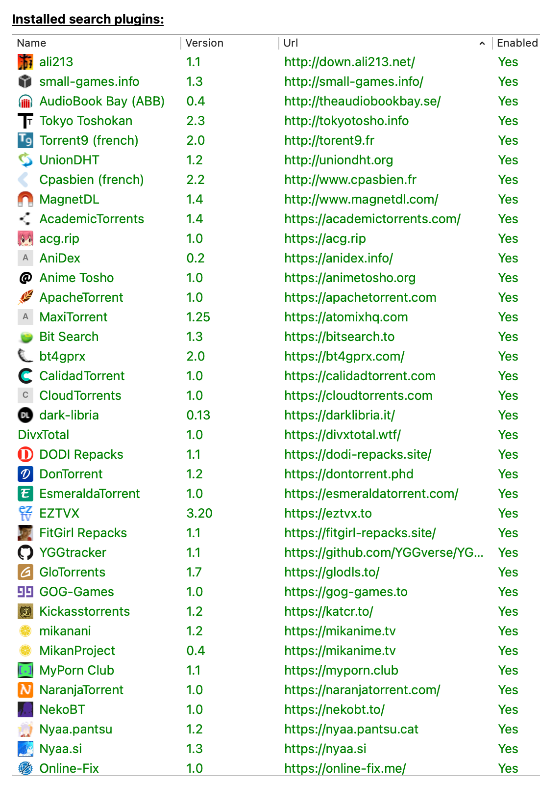

# qBittorrent search plugins

Standalone qBittorrent search engines for Python 3.9+ and qBittorrent's nova3
search-plugin system. Every file in [`plugins/`](plugins/) can be installed on
its own; the repository does not require a shared runtime module.

## Install in under a minute

Choose one of these paths:

- **One plugin:** download a `.py` file from the [plugin catalog](documentation/PLUGINS.md),
  then install it from qBittorrent's Search plugins dialog or drag it into the
  dialog. The optional matching icon is in [`icons/`](icons/).
- **Everything:** download the latest archive from
  [GitHub Releases](https://github.com/UgurGumushan/qbsearch/releases/latest),
  unzip it, quit qBittorrent, and run `install/macos.sh`, `install/linux.sh`,
  or `install/windows.ps1` for your platform.
- **From a clone:** run the native installer for your platform: `./install/macos.sh`,
  `./install/linux.sh`, or `./install/windows.ps1` in PowerShell.

The native installers require no Python, Bun, or other repository runtime. They
always copy the complete collection: engines, matching icons, and support JSON
files. An existing support file is kept so local qBittorrent settings are not
overwritten. qBittorrent should be closed before installation and relaunched
after. See [`documentation/INSTALL.md`](documentation/INSTALL.md) for destination
paths and troubleshooting.

## Browse the plugins

[`documentation/PLUGINS.md`](documentation/PLUGINS.md) is generated from
[`catalog/plugins.json`](catalog/plugins.json) and lists each engine's
category, repository status, site, installable file, and safe default
live-test query. A status describes repository support; it is not a guarantee
that a remote site is online at the moment you search.

Adult-content engines are labeled `adult`. Review the catalog before installing
engines on shared or managed qBittorrent systems.

## Test the live services

The default test command makes real HTTP requests to each active configured
remote site, using each plugin's catalog query and a thread pool sized to the
machine:

```sh
bun run test:live
```

Useful variants:

```sh
bun run test:live -- --plugin yts
bun run test:live -- --content-category anime
bun run test:live -- --query ubuntu
bun run test:live -- --require-results
bun run test:live:watch -- --plugin yts
```

Live tests run each plugin in an isolated Bun/TypeScript subprocess. The worker
validates the plugin's qBittorrent metadata and search contract, probes the
configured endpoint, and reports individual pass/fail status. Empty result
markers are allowed by default because a site may be reachable without
matching records; `--require-results` makes them fail. Use `--install-only` for
an offline metadata and contract check. Catalog entries marked `intermittent`,
`unavailable`, or `retired` are skipped by the default run; pass `--plugin ID`
to probe one explicitly. The TypeScript live-helper suite runs automatically
unless `--skip-safety` is specified.

Do not use sensitive queries in live tests. The query is used to construct the
TypeScript endpoint probe and is sent to the remote service.

Use `test:live:watch` while iterating on a plugin. It runs the same live test,
then reruns it when a plugin source or the catalog changes; pass the same
options after `--` as for `test:live`. Because it makes real requests, stop it
when you are done.

## Maintainer checks

```sh
bun run setup
bun run check
bun run test:watch
bun run test:live
bun run release -- 1.0.0
```

`bun run setup` installs the pinned Bun and Python development dependencies and
enables the automatic pre-commit hook. `bun run check` is deterministic and does
not contact remote sites. Bun owns the repository command layer; Python is
retained only for qBittorrent compatibility harnesses and plugin checks.
Contributor workflow, catalog updates, release packaging, and CI behavior are
documented in [`CONTRIBUTING.md`](CONTRIBUTING.md).

## Screenshot



## Attribution

This collection incorporates engines from multiple upstream projects. See
[`documentation/ATTRIBUTIONS.md`](documentation/ATTRIBUTIONS.md) and
[`LICENSE.md`](LICENSE.md) for
provenance and per-engine licensing. Source and license fields in the catalog
should be completed or corrected when an engine is changed.
