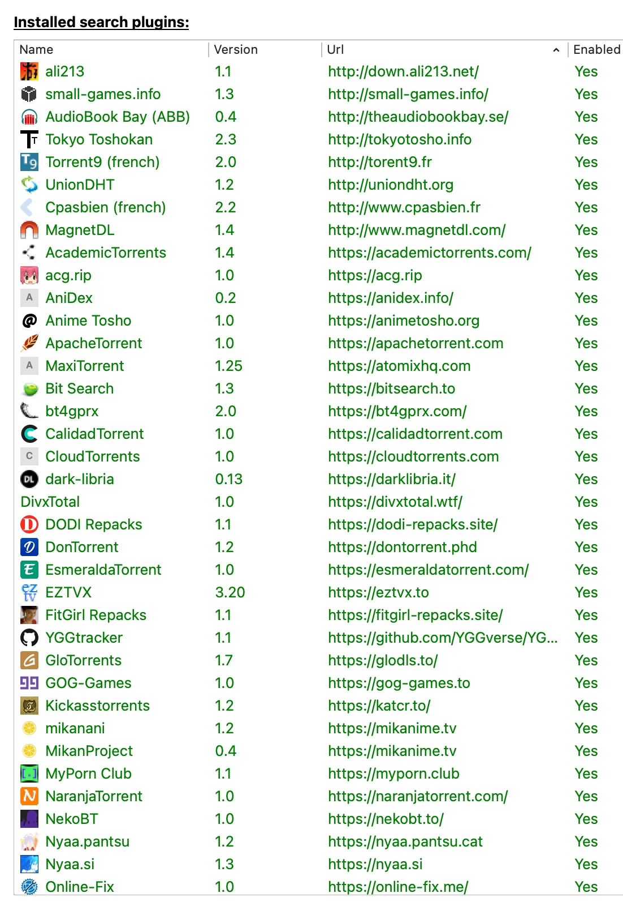

# qbsearch

Search torrent sites directly from qBittorrent with a collection of 58 search
plugins for macOS, Linux, and Windows. Install the complete collection or choose
individual plugins from the list below.

**[Download the latest release (.zip)](https://github.com/UgurGumushan/qbsearch/releases/latest/download/qbsearch-latest.zip)**

The ZIP includes the plugins, matching icons, and installers for all three
platforms. See [release notes and previous versions](https://github.com/UgurGumushan/qbsearch/releases).

## Install the collection

You need qBittorrent with its Search feature enabled and a working Python 3.9+
installation. If the Search tab is hidden, enable **View → Search Engine** in
qBittorrent.

1. [Download the ZIP](https://github.com/UgurGumushan/qbsearch/releases/latest/download/qbsearch-latest.zip)
   and extract it.
2. Quit qBittorrent completely. Open Terminal or PowerShell in the extracted
   `qbsearch-<version>` folder, then run the command for your platform:

   | Platform             | Command                 |
   | -------------------- | ----------------------- |
   | macOS                | `sh install/macos.sh`   |
   | Linux                | `sh install/linux.sh`   |
   | Windows (PowerShell) | `.\install\windows.ps1` |

3. Reopen qBittorrent, open the **Search** tab, and use **Search plugins** to
   choose which engines to enable. Enter a search term and click **Search**.

The installer copies every plugin and matching icon, updates existing plugin
files, and preserves existing support settings. The complete collection includes
the **Adult** entries listed below; individual engines can be disabled in
**Search plugins**.

To update the collection, download the latest ZIP and repeat these steps.
[Installation details](documentation/INSTALL.md) include the destination folders.

## Install individual plugins

1. Choose an engine below, open its **Download** link, and save the file using
   the linked `.py` filename.
2. In qBittorrent, open **Search → Search plugins → Install a new one → Local file**.
3. Select the saved `.py` file and enable the engine.

Repeat for any other engines you want. The collection installer also installs
icons; for a manual installation, matching icons are available in [`icons/`](icons/).

## Plugins

The list follows the [plugin catalog](catalog/plugins.json), grouped by category.
**Active** plugins are maintained, **Intermittent** plugins have known reliability
issues, and **Unavailable** plugins are retained while recovery is investigated.
Status reflects repository maintenance; it does not guarantee current site
availability.

| Plugin                                           | Category | Status       | Download                                                                                                        |
| ------------------------------------------------ | -------- | ------------ | --------------------------------------------------------------------------------------------------------------- |
| [Bit Search](plugins/bitsearch.py)               | General  | Intermittent | [bitsearch.py](https://raw.githubusercontent.com/UgurGumushan/qbsearch/main/plugins/bitsearch.py)               |
| [btdig](plugins/btdig.py)                        | General  | Active       | [btdig.py](https://raw.githubusercontent.com/UgurGumushan/qbsearch/main/plugins/btdig.py)                       |
| [FileMood](plugins/filemood.py)                  | General  | Intermittent | [filemood.py](https://raw.githubusercontent.com/UgurGumushan/qbsearch/main/plugins/filemood.py)                 |
| [Internet Archive](plugins/internetarchive.py)   | General  | Intermittent | [internetarchive.py](https://raw.githubusercontent.com/UgurGumushan/qbsearch/main/plugins/internetarchive.py)   |
| [Knaben](plugins/knaben.py)                      | General  | Intermittent | [knaben.py](https://raw.githubusercontent.com/UgurGumushan/qbsearch/main/plugins/knaben.py)                     |
| [Rutor](plugins/rutor.py)                        | General  | Active       | [rutor.py](https://raw.githubusercontent.com/UgurGumushan/qbsearch/main/plugins/rutor.py)                       |
| [SkTorrent](plugins/sktorrent.py)                | General  | Active       | [sktorrent.py](https://raw.githubusercontent.com/UgurGumushan/qbsearch/main/plugins/sktorrent.py)               |
| [Snowfl](plugins/snowfl.py)                      | General  | Active       | [snowfl.py](https://raw.githubusercontent.com/UgurGumushan/qbsearch/main/plugins/snowfl.py)                     |
| [Solid Torrents](plugins/solidtorrents.py)       | General  | Intermittent | [solidtorrents.py](https://raw.githubusercontent.com/UgurGumushan/qbsearch/main/plugins/solidtorrents.py)       |
| [The Pirate Bay](plugins/thepiratebay.py)        | General  | Active       | [thepiratebay.py](https://raw.githubusercontent.com/UgurGumushan/qbsearch/main/plugins/thepiratebay.py)         |
| [Torlock](plugins/torlock.py)                    | General  | Intermittent | [torlock.py](https://raw.githubusercontent.com/UgurGumushan/qbsearch/main/plugins/torlock.py)                   |
| [Torrent Downloads](plugins/torrentdownloads.py) | General  | Active       | [torrentdownloads.py](https://raw.githubusercontent.com/UgurGumushan/qbsearch/main/plugins/torrentdownloads.py) |
| [TorrentDownload](plugins/torrentdownload.py)    | General  | Active       | [torrentdownload.py](https://raw.githubusercontent.com/UgurGumushan/qbsearch/main/plugins/torrentdownload.py)   |
| [TorrentFunk](plugins/torrentfunk.py)            | General  | Intermittent | [torrentfunk.py](https://raw.githubusercontent.com/UgurGumushan/qbsearch/main/plugins/torrentfunk.py)           |
| [UIndex](plugins/uindex.py)                      | General  | Intermittent | [uindex.py](https://raw.githubusercontent.com/UgurGumushan/qbsearch/main/plugins/uindex.py)                     |
| [UnionDHT](plugins/uniondht.py)                  | General  | Active       | [uniondht.py](https://raw.githubusercontent.com/UgurGumushan/qbsearch/main/plugins/uniondht.py)                 |
| [YourBittorrent](plugins/yourbittorrent.py)      | General  | Active       | [yourbittorrent.py](https://raw.githubusercontent.com/UgurGumushan/qbsearch/main/plugins/yourbittorrent.py)     |
| [ApacheTorrent](plugins/apachetorrent.py)        | Movies   | Active       | [apachetorrent.py](https://raw.githubusercontent.com/UgurGumushan/qbsearch/main/plugins/apachetorrent.py)       |
| [Cpasbien (french)](plugins/cpasbien.py)         | Movies   | Active       | [cpasbien.py](https://raw.githubusercontent.com/UgurGumushan/qbsearch/main/plugins/cpasbien.py)                 |
| [DivxTotal](plugins/divxtotal.py)                | Movies   | Active       | [divxtotal.py](https://raw.githubusercontent.com/UgurGumushan/qbsearch/main/plugins/divxtotal.py)               |
| [DonTorrent](plugins/dontorrent.py)              | Movies   | Active       | [dontorrent.py](https://raw.githubusercontent.com/UgurGumushan/qbsearch/main/plugins/dontorrent.py)             |
| [Elitetorrent](plugins/elitetorrent.py)          | Movies   | Active       | [elitetorrent.py](https://raw.githubusercontent.com/UgurGumushan/qbsearch/main/plugins/elitetorrent.py)         |
| [EsmeraldaTorrent](plugins/esmeraldatorrent.py)  | Movies   | Active       | [esmeraldatorrent.py](https://raw.githubusercontent.com/UgurGumushan/qbsearch/main/plugins/esmeraldatorrent.py) |
| [MaxiTorrent](plugins/maxitorrent.py)            | Movies   | Active       | [maxitorrent.py](https://raw.githubusercontent.com/UgurGumushan/qbsearch/main/plugins/maxitorrent.py)           |
| [NaranjaTorrent](plugins/naranjatorrent.py)      | Movies   | Active       | [naranjatorrent.py](https://raw.githubusercontent.com/UgurGumushan/qbsearch/main/plugins/naranjatorrent.py)     |
| [Pirateiro](plugins/pirateiro.py)                | Movies   | Unavailable  | [pirateiro.py](https://raw.githubusercontent.com/UgurGumushan/qbsearch/main/plugins/pirateiro.py)               |
| [The RarBg](plugins/therarbg.py)                 | Movies   | Active       | [therarbg.py](https://raw.githubusercontent.com/UgurGumushan/qbsearch/main/plugins/therarbg.py)                 |
| [TomaDivx](plugins/tomadivx.py)                  | Movies   | Active       | [tomadivx.py](https://raw.githubusercontent.com/UgurGumushan/qbsearch/main/plugins/tomadivx.py)                 |
| [Torrent9 (french)](plugins/torrent9.py)         | Movies   | Active       | [torrent9.py](https://raw.githubusercontent.com/UgurGumushan/qbsearch/main/plugins/torrent9.py)                 |
| [TorrentClaw](plugins/torrentclaw.py)            | Movies   | Intermittent | [torrentclaw.py](https://raw.githubusercontent.com/UgurGumushan/qbsearch/main/plugins/torrentclaw.py)           |
| [Traht](plugins/traht.py)                        | Movies   | Intermittent | [traht.py](https://raw.githubusercontent.com/UgurGumushan/qbsearch/main/plugins/traht.py)                       |
| [YTS](plugins/yts.py)                            | Movies   | Active       | [yts.py](https://raw.githubusercontent.com/UgurGumushan/qbsearch/main/plugins/yts.py)                           |
| [EZTVX](plugins/eztvx.py)                        | TV       | Active       | [eztvx.py](https://raw.githubusercontent.com/UgurGumushan/qbsearch/main/plugins/eztvx.py)                       |
| [acg.rip](plugins/acgrip.py)                     | Anime    | Active       | [acgrip.py](https://raw.githubusercontent.com/UgurGumushan/qbsearch/main/plugins/acgrip.py)                     |
| [AniLiberty](plugins/aniliberty.py)              | Anime    | Intermittent | [aniliberty.py](https://raw.githubusercontent.com/UgurGumushan/qbsearch/main/plugins/aniliberty.py)             |
| [Anime Tosho](plugins/animetosho.py)             | Anime    | Active       | [animetosho.py](https://raw.githubusercontent.com/UgurGumushan/qbsearch/main/plugins/animetosho.py)             |
| [DMHY](plugins/dmhy.py)                          | Anime    | Active       | [dmhy.py](https://raw.githubusercontent.com/UgurGumushan/qbsearch/main/plugins/dmhy.py)                         |
| [mikanani](plugins/mikanani.py)                  | Anime    | Active       | [mikanani.py](https://raw.githubusercontent.com/UgurGumushan/qbsearch/main/plugins/mikanani.py)                 |
| [MikanProject](plugins/mikan.py)                 | Anime    | Active       | [mikan.py](https://raw.githubusercontent.com/UgurGumushan/qbsearch/main/plugins/mikan.py)                       |
| [NekoBT](plugins/nekobt.py)                      | Anime    | Active       | [nekobt.py](https://raw.githubusercontent.com/UgurGumushan/qbsearch/main/plugins/nekobt.py)                     |
| [Nyaa.si](plugins/nyaasi.py)                     | Anime    | Active       | [nyaasi.py](https://raw.githubusercontent.com/UgurGumushan/qbsearch/main/plugins/nyaasi.py)                     |
| [SubsPlease](plugins/subsplease.py)              | Anime    | Active       | [subsplease.py](https://raw.githubusercontent.com/UgurGumushan/qbsearch/main/plugins/subsplease.py)             |
| [Tokyo Toshokan](plugins/tokyotoshokan.py)       | Anime    | Active       | [tokyotoshokan.py](https://raw.githubusercontent.com/UgurGumushan/qbsearch/main/plugins/tokyotoshokan.py)       |
| [AcademicTorrents](plugins/academictorrents.py)  | Software | Active       | [academictorrents.py](https://raw.githubusercontent.com/UgurGumushan/qbsearch/main/plugins/academictorrents.py) |
| [bt4gprx](plugins/bt4gprx.py)                    | Software | Active       | [bt4gprx.py](https://raw.githubusercontent.com/UgurGumushan/qbsearch/main/plugins/bt4gprx.py)                   |
| [LinuxTracker](plugins/linuxtracker.py)          | Software | Intermittent | [linuxtracker.py](https://raw.githubusercontent.com/UgurGumushan/qbsearch/main/plugins/linuxtracker.py)         |
| [ali213](plugins/ali213.py)                      | Games    | Unavailable  | [ali213.py](https://raw.githubusercontent.com/UgurGumushan/qbsearch/main/plugins/ali213.py)                     |
| [DODI Repacks](plugins/dodi_repacks.py)          | Games    | Active       | [dodi_repacks.py](https://raw.githubusercontent.com/UgurGumushan/qbsearch/main/plugins/dodi_repacks.py)         |
| [FitGirl Repacks](plugins/fitgirl_repacks.py)    | Games    | Active       | [fitgirl_repacks.py](https://raw.githubusercontent.com/UgurGumushan/qbsearch/main/plugins/fitgirl_repacks.py)   |
| [Online-Fix](plugins/onlinefix.py)               | Games    | Active       | [onlinefix.py](https://raw.githubusercontent.com/UgurGumushan/qbsearch/main/plugins/onlinefix.py)               |
| [small-games.info](plugins/smallgames.py)        | Games    | Active       | [smallgames.py](https://raw.githubusercontent.com/UgurGumushan/qbsearch/main/plugins/smallgames.py)             |
| [AudioBook Bay (ABB)](plugins/audiobookbay.py)   | Books    | Active       | [audiobookbay.py](https://raw.githubusercontent.com/UgurGumushan/qbsearch/main/plugins/audiobookbay.py)         |
| [dark-libria](plugins/darklibria.py)             | Books    | Active       | [darklibria.py](https://raw.githubusercontent.com/UgurGumushan/qbsearch/main/plugins/darklibria.py)             |
| [MyPorn Club](plugins/mypornclub.py)             | Adult    | Active       | [mypornclub.py](https://raw.githubusercontent.com/UgurGumushan/qbsearch/main/plugins/mypornclub.py)             |
| [Nyaa.pantsu](plugins/nyaapantsu.py)             | Adult    | Active       | [nyaapantsu.py](https://raw.githubusercontent.com/UgurGumushan/qbsearch/main/plugins/nyaapantsu.py)             |
| [Sukebei (Nyaa)](plugins/sukebeisi.py)           | Adult    | Active       | [sukebeisi.py](https://raw.githubusercontent.com/UgurGumushan/qbsearch/main/plugins/sukebeisi.py)               |
| [Sukebei Nyaa](plugins/nyaa_phuong.py)           | Adult    | Active       | [nyaa_phuong.py](https://raw.githubusercontent.com/UgurGumushan/qbsearch/main/plugins/nyaa_phuong.py)           |
| [XXXClub](plugins/xxxclubto.py)                  | Adult    | Active       | [xxxclubto.py](https://raw.githubusercontent.com/UgurGumushan/qbsearch/main/plugins/xxxclubto.py)               |

See the [detailed catalog](documentation/PLUGINS.md) for site links, maintenance
notes, and licensing information.

## Help

- **No Search tab:** enable **View → Search Engine** and follow qBittorrent's
  [search plugin setup guide](https://github.com/qbittorrent/search-plugins/wiki/Install-search-plugins)
  if Python is not detected.
- **Plugin missing after installation:** quit and reopen qBittorrent, then check
  **Search plugins**. The [installation guide](documentation/INSTALL.md) lists
  the folders where the installers place the files.
- **An engine returns no results:** check its status above and try another engine.
  Sites can be temporarily unavailable or inaccessible from your network.

## Screenshot

## Contributing

For development setup, checks, live testing, and release procedures, see
[`CONTRIBUTING.md`](CONTRIBUTING.md).

## Attribution and license

This collection includes engines from multiple upstream projects. See
[attributions](documentation/ATTRIBUTIONS.md), [licenses](LICENSE.md), and the
[upstream license provenance audit](documentation/LICENSE_PROVENANCE.md) for
per-engine licensing details.
